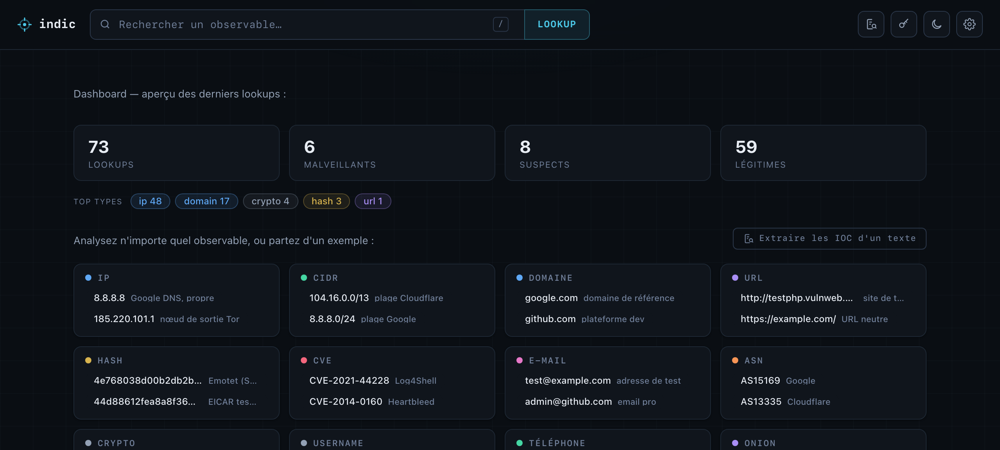
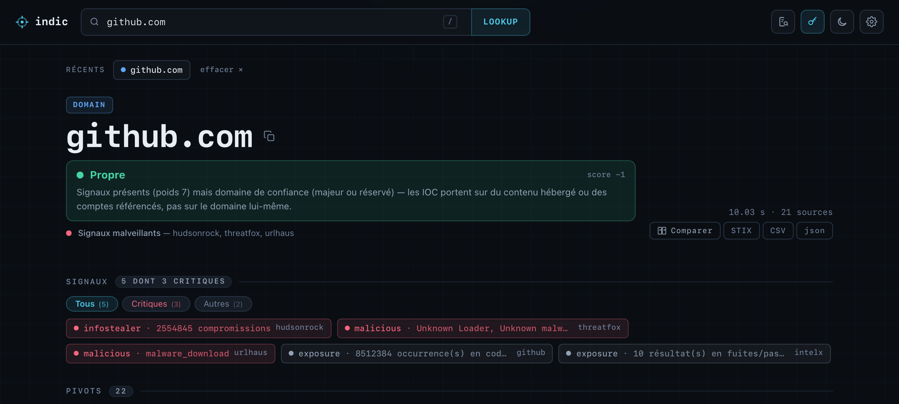
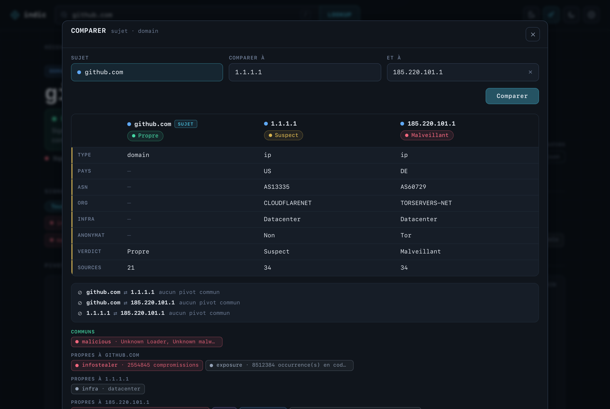

# indic

[](https://github.com/Wes974/indic/actions/workflows/ci.yml)
[](LICENSE)
[](https://www.rust-lang.org)

**A single-binary CTI / OSINT enrichment platform in Rust.** Paste (almost)
any observable and get aggregated threat-intel from ~75 free and keyed sources,
a calibrated verdict, a recursive pivot graph, and proactive monitoring.

> Personal project, built for **defensive** and **authorized** security research
> (blue-team, CTI, OSINT). No offensive tooling. See the disclaimer below.

## Screenshots

The landing page — a dashboard of recent lookups, then 13 observable types with
clickable examples:



A domain report with the **calibrated verdict** — `github.com` reads **clean**
despite three critical signals (infostealer credentials, ThreatFox, URLhaus),
thanks to the corroboration + popularity model: the IOCs point at *hosted*
content, not at the domain itself.



The comparator — the report you are on, side by side with up to two other
observables. Only diverging rows are marked, so differences read at a glance:



---

## What it does

Give it an observable — indic detects the type, fans out to every relevant
source in parallel, dedups, caches, and returns one unified report.

**13 observable types**: `ip`, `cidr`, `domain`, `url`, `email`, `hash`, `cve`,
`asn`, `crypto` (BTC/ETH + tx), `username`, `phone`, `.onion`, `package`
(`pkg:pypi/requests` → OSV).

**Highlights**
- **~75 enrichers** — geo/ASN, VPN/proxy/Tor/relay attribution (spur.us-style),
  threat feeds, blocklists, RDAP/DNS/CT, passive DNS, sandbox/AV, leaks/pastes,
  crypto sanctions, and more. Keyed sources activate only if their key is present.
- **Comparator** — the current report against 1 or 2 other observables: aligned
  attributes with only the diverging rows marked, shared pivots, and a
  common/unique split of the signals.
- **IOC extractor** — paste an incident report, a phishing mail or raw logs;
  every analysable observable comes back grouped by type, one click to enrich.
- **Weighted verdict** — corroboration-based scoring (multiple independent
  sources required) + a popularity prior (curated list + Majestic top-100k +
  reserved domains) so legitimate platforms that *host* malware aren't flagged
  malicious.
- **Recursive pivot graph** — force-directed canvas, expand-on-click across
  domain ↔ IP ↔ ASN ↔ CVE ↔ crypto address, etc.
- **Public PoC lookup** for CVEs (offline index) alongside full CVE data
  (NVD / EPSS / OSV / CISA KEV).
- **Proactive veille** — scheduled watchers (CISA KEV, paste keywords, Apple
  security releases) that alert on *new* findings via Pushover.
- **Optional MISP / OpenCTI push** — send curated / corroborated IOCs downstream.
- **Offline-first datasets** — IP-to-ASN, PeeringDB, cloud ranges, VPN provider
  ranges, blocklists, GeoLite2, refreshed on a schedule.

## Quickstart

```bash
# 1. Configure — copy the template and fill in the keys you have (all optional).
cp .env.example .env

# 2a. Run with Docker (recommended)
docker compose up -d --build
# 2b. …or build and run natively
cargo build --release && ./target/release/indic serve
```

First launch downloads the offline datasets, then serves on `127.0.0.1:8080`.
Put it behind your own reverse-proxy / tunnel (Cloudflare, Caddy, nginx…).

```bash
# CLI one-shot lookup (no server)
cargo run --release -- lookup 8.8.8.8
```

### Endpoints

| Route | Purpose |
|---|---|
| `GET /` | Web UI (dark/light, pivot graph, comparator, IOC extractor) |
| `GET /lookup?q=<observable>` | Enrich any observable |
| `GET /lookup/export?q=…&format=stix\|csv` | Same report as STIX 2.1 or CSV |
| `POST /lookup/bulk` | Enrich a batch of observables |
| `POST /compare` | 2–3 observables side by side (`{"items":[…]}`) |
| `POST /extract` | Pull observables out of free-form text |
| `GET /dashboard` | Public counters over recent lookups |
| `GET /healthz` | Liveness |
| `GET /metrics` | Per-source counters, JSON or `?format=prometheus` (gated) |
| `GET /settings` | Key-presence status (gated, never returns values) |
| `GET /history` | Recent lookups, if `INDIC_HISTORY=1` (gated) |
| `GET /correlate?q=<observable>` | Correlations across history (gated) |
| `POST /push` | Enrich then push to MISP/OpenCTI (gated) |

The web UI lists these under **Settings → Endpoints**, with a ready-to-paste
`curl` for each — the token goes in the `x-indic-token` header there, never in
a URL that would land in browser history or proxy logs.

Keyed enrichers require a token (`INDIC_TOKEN`) via `?token=`, the
`x-indic-token` header, or the `indic_token` cookie. With no token configured
and paid keys present, the service fails closed to protect your quotas.

## Configuration

Everything is environment-driven — see [`.env.example`](.env.example) for the
full list of supported API keys (all optional) and feed overrides. No key is
ever required; each source simply activates when its key is set.

Proactive veille is opt-in: set `INDIC_VEILLE_ENABLED=1` and Pushover
`PUSHOVER_TOKEN` / `PUSHOVER_USER` to receive alerts.

## Architecture

```
observable.rs   type detection
enrich.rs       parallel dispatch + TTL cache + per-source/global rate limits
enrich/*.rs     one module per source
store.rs        offline datasets (hot-swappable via arc-swap)
ranges.rs       O(log n) CIDR membership over sorted u32 intervals
verdict.rs      corroboration + popularity → calibrated verdict
veille.rs       scheduled watchers → Pushover
push.rs         MISP + OpenCTI push
api.rs          axum HTTP + embedded web UI (web/index.html via include_str!)
```

Single distroless image, no OpenSSL (reqwest on rustls). Builds for `arm64`/`amd64`.

**Front-end**: vanilla JS, no framework and no bundler. `build.rs` inlines
`style.css` and `app.js` into `index.html` at compile time, so the whole UI ships
as one request from the binary — nothing to deploy alongside it. It is still
type-checked: JSDoc annotations verified by `tsc --checkJs --noEmit`, run in CI
next to a Playwright end-to-end suite.

## Disclaimer

indic is a personal tool for **defensive** security, threat intelligence, and
OSINT on assets you are **authorized** to investigate. Aggregated sources have
their own Terms of Service, licenses, and rate limits — respect them and use
your own API keys. Some capabilities (e.g. username enumeration across sites)
can be abused; use responsibly and within the law. Provided **as-is, without
warranty**.

## License

MIT — see [`LICENSE`](LICENSE).
